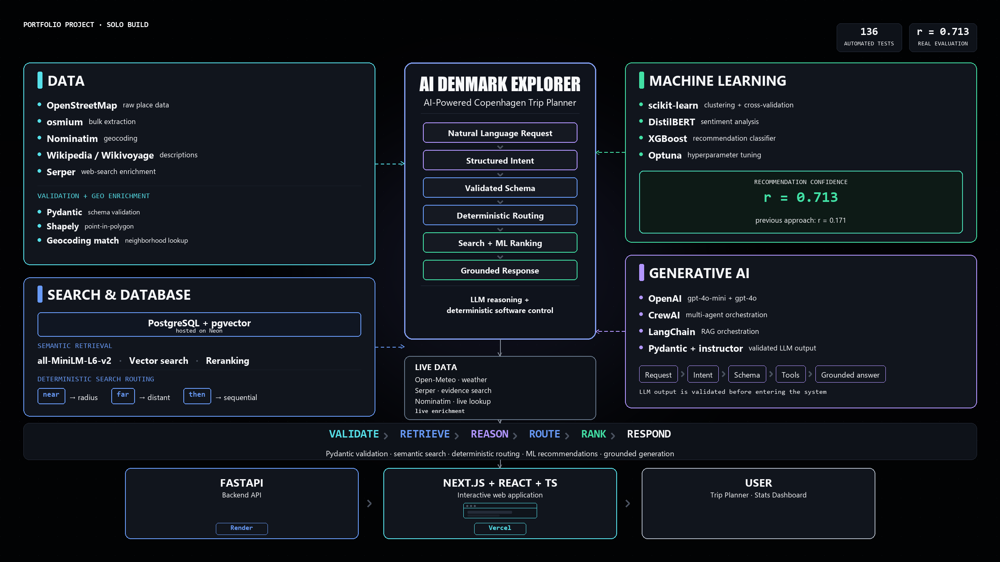

# AI Denmark Explorer

An AI-powered place-discovery app for Copenhagen that doubles as a
deliberate showcase of the modern full-stack AI/ML toolkit — SQL,
embeddings, RAG, multi-agent orchestration, classical ML, a React/Next.js
frontend, and real deployment engineering — built, deployed, and debugged
solo, entirely on free-tier infrastructure.

**[Live app](https://ai-denmark-explorer.vercel.app/)** ·
**[Live API](https://ai-denmark-explorer-api.onrender.com/health)**

## What it does

- **Explore** — semantic ("vibe") search over 1,897 real Copenhagen places (restaurants, cafes, hotels, landmarks), each with a predicted quality score, a named vibe cluster, and an AI-grounded summary with cited sources.
- **Trip Planner** — two [CrewAI](https://www.crewai.com/) agents (Intent Analyst, Concierge) collaborate live to plan a real, honest trip recommendation, grounded in real weather and real place data — never inventing a fact it can't cite. The Intent Analyst turns a free-text request into a validated structured spec (Pydantic + `instructor`); a plain backend function then decides how each part gets searched — near/far/sequential/area — deterministically, so the LLM reasons about intent but never about spatial routing. Each recommended place carries a live `recommendation_confidence` score (XGBoost, computed fresh from real review text on every request, never a stale stored number). A live-lookup fallback (Nominatim, with Serper as a second fallback) honestly flags any place outside the curated dataset instead of pretending it has the same evidence behind it. Repeat and near-repeat requests are served from a database-backed cache instead of re-running the agents.
- **Stats Dashboard** — real aggregate SQL analytics (`GROUP BY`/`FILTER`), computed live from Postgres on every request (not pre-baked at build time), rendered as charts, plus a Model Evaluation section reporting the recommendation model's real backtested correlation against actual outcomes.

## Architecture



One request pipeline, six steps: a natural-language request becomes a
validated structured intent, gets routed and searched deterministically,
ranked by a real ML model, and answered with a grounded response. The LLM
reasons about what the traveler means — never about where to search or
what's true.

**Request flow**: Natural Language Request → Structured Intent → Validated
Schema → Deterministic Routing → Search + ML Ranking → Grounded Response.

**Data.** Real Copenhagen places (1,897 and counting) come from
OpenStreetMap, bulk-loaded via `osmium` and enriched on-demand through
Nominatim. Wikipedia/Wikivoyage supply place descriptions; Serper (web
search) fills in the rest for places with thin data, with every candidate
independently re-verified before it's trusted. Every incoming record is
validated with Pydantic and neighborhood-matched via real point-in-polygon
geometry (Shapely) against official Danish district boundaries, not a
slow, rate-limited geocoding API.

**Search & database.** PostgreSQL (Neon, scale-to-zero) with pgvector
stores every place and its embedding (`all-MiniLM-L6-v2`). Semantic search
retrieves by meaning, then a reranking layer combines that similarity with
real lexical name-matching so an exact-name query doesn't get buried under
topically-similar decoys. Spatial relationships — near an anchor, far from
it, a sequence, a neighborhood constraint — are resolved by explicit
backend routing, never inferred by the LLM.

**Machine learning.** A `recommendation_confidence` score is computed live
for every recommended place: DistilBERT's offline-precomputed sentiment
reading and a freshly-computed MiniLM semantic-nuance signal both feed a
trained XGBoost classifier. Backtested against real outcomes at Pearson
r = 0.713 — more than 4x the correlation of the quality-score model it
replaced in this path (r = 0.171). Optuna tunes hyperparameters; a
separate, Explore-only XGBoost model still handles the original
quality-score ranking task.

**Generative AI.** Two CrewAI agents. The Intent Analyst (OpenAI
`gpt-4o-mini`) turns free text into a validated structured spec — it has
no database tools at all. The Concierge (OpenAI `gpt-4o`) narrates the
final answer from real retrieved data, with an explicit guard against
claiming proximity or facts the pipeline didn't actually establish.
LangChain runs the separate RAG-summary pipeline that produces Explore's
cited place summaries.

**Live services.** Open-Meteo (real weather for the actual requested date,
not a fixed lookup table), Serper (evidence search), and Nominatim (live
place lookup) run alongside the main search path, each with its own
honest fallback if it comes back empty.

**Application layer.** FastAPI backend on Render, Next.js/React/TypeScript
frontend on Vercel, calling the API directly from the browser.

**Quality.** 136 automated tests, GitHub Actions CI, `ruff` linting.

See [`docs/architecture.md`](docs/architecture.md) for the full technical
write-up and [`docs/technique_map.md`](docs/technique_map.md) for the
complete technique-to-implementation mapping.

## Key results

| Model | Result |
|---|---|
| Recommendation confidence (XGBoost classifier, live per-request) | Powers the Trip Planner. Backtested against real outcomes: Pearson r = 0.713, vs r = 0.171 for the quality-score model it replaced in that path — same evaluation methodology, run on the same real places |
| Quality-score prediction (XGBoost, Optuna-tuned) | Still powers Explore's ranking. 83% of predictions within ±10 points of the true score (RMSE 8.76, R² 0.12 on 172 labeled examples — honestly reported, not inflated) |
| Weather-aware visit forecast (XGBoost, chronological split) | 97% within ±10 points (RMSE 3.39, R² 0.98) |
| RAG-summary prompt A/B test | Ran live on real places (20 GPT-4o generations, $0.027 total) with a deterministic scorer — no second LLM call needed to judge the first |

## Real engineering, not just a demo

This project was built, then actually used — and using it surfaced real bugs
that got root-caused and fixed with evidence, not guessed at:

- **Deployment**: hit and fixed 4 separate production failures getting this live on a free-tier host — a Python-version/build-sandbox mismatch, a missing transitive dependency only exposed by a narrower install, an out-of-memory kill traced to one specific import (not the framework everyone would've blamed), and a CI dependency gap. Full root-cause log: [`docs/deployment_troubleshooting.md`](docs/deployment_troubleshooting.md).
- **Data quality**: found live that a famous landmark returned zero search results (rank 701/1,896 at the time) because its only stored text was a bare Danish name — fixed with a web-enrichment pipeline, verified the fix moved it to rank 1.
- **Data quality, part 2**: every place originally had no neighborhood assigned. Fixed via point-in-polygon matching against real Danish government district boundaries (opendata.dk + DAWA) instead of a slow, rate-limited API — 99.9% matched in 36 seconds.
- **Agent behavior**: found live that a real intent-classification bug let a sequence word like "then" leak into a spatial-relationship field, causing the agent to search "near" a place that was never actually meant as an anchor — fixed by moving spatial routing out of the LLM entirely into a validated, deterministic backend function.

## Tech stack

**Data**: PostgreSQL (Neon) · pgvector · OpenStreetMap · Wikivoyage · Open-Meteo · opendata.dk / DAWA
**ML**: scikit-learn · XGBoost · Optuna · MLflow · sentence-transformers / fastembed · DistilBERT (offline sentiment scoring)
**LLM / Agents**: GPT-4o · GPT-4o-mini · LangChain · CrewAI · Pydantic + `instructor` (validated structured intent) · Serper (web-search fallback)
**Backend**: FastAPI (Render)
**Frontend**: React · Next.js (App Router, Server + Client Components) · TypeScript · Tailwind CSS · Recharts, deployed on Vercel
**Quality**: pytest · ruff · GitHub Actions CI

## Setup

```bash
python -m venv .venv
.venv\Scripts\activate   # Windows
pip install -e ".[dev]"
cp .env.example .env     # fill in DATABASE_URL, OPENAI_API_KEY
psql $DATABASE_URL -f db/schema.sql
pytest
```

### The `agent` extra: use a short-path venv on Windows

`pip install -e ".[dev,embeddings,rag,agent]"` pulls in `crewai`, which
depends on `torch` — and torch's own bundled license files are nested deep
enough that combined with a long project path (e.g.
`...\deeply\nested\parent\folder\ai-denmark-explorer\.venv\...`), the
install can hit Windows' 260-character path limit. If that happens, create
the venv at a
short path outside the project instead, e.g.:

```bash
python -m venv C:\Users\<you>\.venvs\ade
C:\Users\<you>\.venvs\ade\Scripts\python.exe -m pip install -e ".[dev,embeddings,rag,agent]"
```

Also install this extra in its own venv, not one shared with other
projects — `crewai` requires `langchain-core>=1.0`, which conflicts with the
`langchain 0.3.x` pin used elsewhere on the same machine.

Run the API: `uvicorn api.main:app --port 8000`, then
`POST /trip-plan {"request": "...", "target_date": "YYYY-MM-DD", "start_location": "..."}`.

### Frontend (React/Next.js)

```bash
cd web
npm install
cp .env.local.example .env.local   # NEXT_PUBLIC_TRIP_PLANNER_API_URL, defaults to localhost:8000
npm run dev
```

Requires the API above running locally (or point `.env.local` at the live
Render URL). `npm run build` runs the same TypeScript/Next.js checks CI and
Vercel both run.

## Scope

Copenhagen only for now. Architecture is designed to extend to other Danish
cities later, not built to require it from day one.
